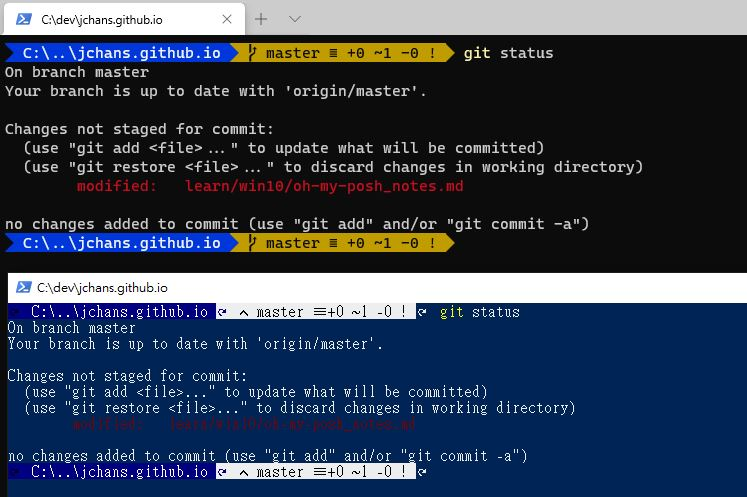

# oh-my-posh Notes

### 參考連結

- [使用 oh-my-posh 美化 PowerShell 樣式](https://blog.poychang.net/setting-powershell-theme-with-oh-my-posh/)

  - 照這個網頁的教學做完，可能會遇到 oh-my-posh 無法載入的問題
  - 需要調整 Windows Terminal / PowerShell 的設定，調整 [Set-ExecutionPolicy](https://ss64.com/ps/set-executionpolicy.html) 為 Unrestricted 即可正常 Import Module
- [Windows PowerShell 設定檔 settings.json 設定字體為 Cascadia Code PL](https://docs.microsoft.com/zh-tw/windows/terminal/tutorials/powerline-setup)
- [Cascadia Code 2009.22 字體下載](https://github.com/microsoft/cascadia-code/releases/tag/v2009.22)
- [隱藏 Terminal 中的 user name](https://github.com/JanDeDobbeleer/oh-my-posh/issues/163)
- [oh-my-posh V2 repo](https://github.com/JanDeDobbeleer/oh-my-posh)
  - V3 開發中，目前就使用 V2
- [安裝 Windows Terminal](https://www.microsoft.com/zh-tw/p/windows-terminal/9n0dx20hk701?activetab=pivot:overviewtab)
- [一些 Windows Terminal 的 hotkey ](https://defkey.com/windows-terminal-shortcuts)

## 使用 Windows Terminal / PowerShell / oh-my-posh 的原因

- 在 Windows 10 的環境下使用 Git ，我用 PowerShell ，一些指令與 Unix-like 的 Terminal 比較接近
- 改善 PowerShell 的內建顏色在使用 git status 等指令顯示的資訊有點難閱讀
- 找到了類似 [oh-my-zsh](https://ohmyz.sh/) 的模組 [oh-my-posh](https://github.com/JanDeDobbeleer/oh-my-posh) 來用

比較 Windows Terminal（下圖上） 與 PowerShell （下圖下）用 oh-my-posh 的效果：

